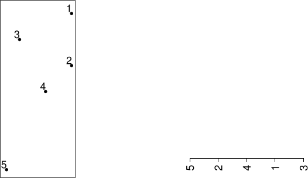
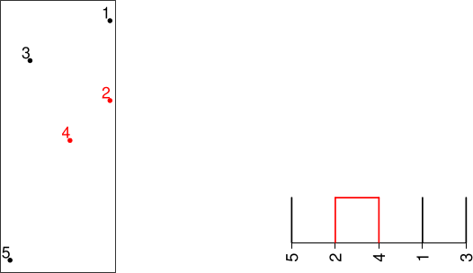
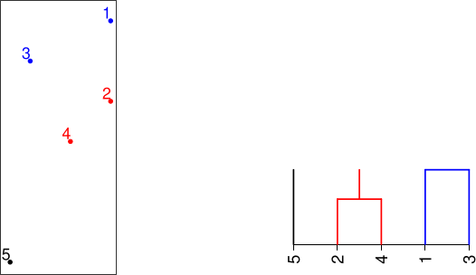
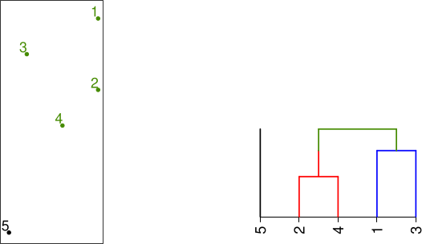
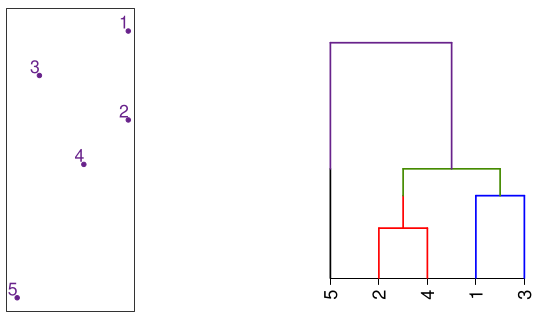

```{r}
#| label: setup
#| include: false
source("../R/functions.R")
```


# Objectifs

## Panorama des méthodes

Rechercher dans un jeu de données une répartition des observations en diérentes
groupes... Source: [documentation Scikit-learn](https://scikit-learn.org/stable/auto_examples/cluster/plot_cluster_comparison.html)

```{python}
#| echo: false
# Authors: The scikit-learn developers
# SPDX-License-Identifier: BSD-3-Clause

import time
import warnings
from itertools import cycle, islice

import matplotlib.pyplot as plt
import numpy as np

from sklearn import cluster, datasets, mixture
from sklearn.neighbors import kneighbors_graph
from sklearn.preprocessing import StandardScaler

# ============
# Generate datasets. We choose the size big enough to see the scalability
# of the algorithms, but not too big to avoid too long running times
# ============
n_samples = 500
seed = 30
noisy_circles = datasets.make_circles(
    n_samples=n_samples, factor=0.5, noise=0.05, random_state=seed
)
noisy_moons = datasets.make_moons(n_samples=n_samples, noise=0.05, random_state=seed)
blobs = datasets.make_blobs(n_samples=n_samples, random_state=seed)
rng = np.random.RandomState(seed)
no_structure = rng.rand(n_samples, 2), None

# Anisotropicly distributed data
random_state = 170
X, y = datasets.make_blobs(n_samples=n_samples, random_state=random_state)
transformation = [[0.6, -0.6], [-0.4, 0.8]]
X_aniso = np.dot(X, transformation)
aniso = (X_aniso, y)

# blobs with varied variances
varied = datasets.make_blobs(
    n_samples=n_samples, cluster_std=[1.0, 2.5, 0.5], random_state=random_state
)

# ============
# Set up cluster parameters
# ============
plt.figure(figsize=(18, 10.5))
plt.subplots_adjust(
  left=0.02, right=0.96, bottom=0.03, top=0.88, wspace=0.04, hspace=0.08
)

plot_num = 1

default_base = {
    "quantile": 0.3,
    "eps": 0.3,
    "damping": 0.9,
    "preference": -200,
    "n_neighbors": 3,
    "n_clusters": 3,
    "min_samples": 7,
    "xi": 0.05,
    "min_cluster_size": 0.1,
    "allow_single_cluster": True,
    "hdbscan_min_cluster_size": 15,
    "hdbscan_min_samples": 3,
    "random_state": 42,
}

datasets = [
    (
        noisy_circles,
        {
            "damping": 0.77,
            "preference": -240,
            "quantile": 0.2,
            "n_clusters": 2,
            "min_samples": 7,
            "xi": 0.08,
        },
    ),
    (
        noisy_moons,
        {
            "damping": 0.75,
            "preference": -220,
            "n_clusters": 2,
            "min_samples": 7,
            "xi": 0.1,
        },
    ),
    (
        varied,
        {
            "eps": 0.18,
            "n_neighbors": 2,
            "min_samples": 7,
            "xi": 0.01,
            "min_cluster_size": 0.2,
        },
    ),
    (
        aniso,
        {
            "eps": 0.15,
            "n_neighbors": 2,
            "min_samples": 7,
            "xi": 0.1,
            "min_cluster_size": 0.2,
        },
    ),
    (blobs, {"min_samples": 7, "xi": 0.1, "min_cluster_size": 0.2}),
    (no_structure, {}),
]

for i_dataset, (dataset, algo_params) in enumerate(datasets):
    # update parameters with dataset-specific values
    params = default_base.copy()
    params.update(algo_params)

    X, y = dataset

    # normalize dataset for easier parameter selection
    X = StandardScaler().fit_transform(X)

    # estimate bandwidth for mean shift
    bandwidth = cluster.estimate_bandwidth(X, quantile=params["quantile"])

    # connectivity matrix for structured Ward
    connectivity = kneighbors_graph(
        X, n_neighbors=params["n_neighbors"], include_self=False
    )
    # make connectivity symmetric
    connectivity = 0.5 * (connectivity + connectivity.T)

    # ============
    # Create cluster objects
    # ============
    ms = cluster.MeanShift(bandwidth=bandwidth, bin_seeding=True)
    two_means = cluster.MiniBatchKMeans(
        n_clusters=params["n_clusters"],
        random_state=params["random_state"],
    )
    ward = cluster.AgglomerativeClustering(
        n_clusters=params["n_clusters"], linkage="ward", connectivity=connectivity
    )
    spectral = cluster.SpectralClustering(
        n_clusters=params["n_clusters"],
        eigen_solver="arpack",
        affinity="nearest_neighbors",
        random_state=params["random_state"],
    )
    dbscan = cluster.DBSCAN(eps=params["eps"])
    hdbscan = cluster.HDBSCAN(
        min_samples=params["hdbscan_min_samples"],
        min_cluster_size=params["hdbscan_min_cluster_size"],
        allow_single_cluster=params["allow_single_cluster"],
        copy=True,
    )
    optics = cluster.OPTICS(
        min_samples=params["min_samples"],
        xi=params["xi"],
        min_cluster_size=params["min_cluster_size"],
    )
    affinity_propagation = cluster.AffinityPropagation(
        damping=params["damping"],
        preference=params["preference"],
        random_state=params["random_state"],
    )
    average_linkage = cluster.AgglomerativeClustering(
        linkage="average",
        metric="cityblock",
        n_clusters=params["n_clusters"],
        connectivity=connectivity,
    )
    birch = cluster.Birch(n_clusters=params["n_clusters"])
    gmm = mixture.GaussianMixture(
        n_components=params["n_clusters"],
        covariance_type="full",
        random_state=params["random_state"],
    )

    clustering_algorithms = (
        ("Raw data", None),
        ("MiniBatch\nKMeans", two_means),
        ("Affinity\nPropagation", affinity_propagation),
        ("MeanShift", ms),
        ("Spectral\nClustering", spectral),
        ("Ward", ward),
        ("Agglomerative\nClustering", average_linkage),
        ("DBSCAN", dbscan),
        ("HDBSCAN", hdbscan),
        ("OPTICS", optics),
        ("BIRCH", birch),
        ("Gaussian\nMixture", gmm),
    )

    for name, algorithm in clustering_algorithms:
        ax = plt.subplot(len(datasets), len(clustering_algorithms), plot_num)
        ax.set_aspect("equal", adjustable="box")
        if i_dataset == 0:
            plt.title(name, size=18)

        if algorithm is None:
            # Reference column: show the standardized observations without clusters.
            plt.scatter(X[:, 0], X[:, 1], s=10, color="#000000")
            plt.xlim(-2.5, 2.5)
            plt.ylim(-2.5, 2.5)
            plt.xticks(())
            plt.yticks(())
            plot_num += 1
            continue

        t0 = time.time()

        # catch warnings related to kneighbors_graph
        with warnings.catch_warnings():
            warnings.filterwarnings(
                "ignore",
                message="the number of connected components of the "
                "connectivity matrix is [0-9]{1,2}"
                " > 1. Completing it to avoid stopping the tree early.",
                category=UserWarning,
            )
            warnings.filterwarnings(
                "ignore",
                message="Graph is not fully connected, spectral embedding"
                " may not work as expected.",
                category=UserWarning,
            )
            algorithm.fit(X)

        t1 = time.time()
        if hasattr(algorithm, "labels_"):
            y_pred = algorithm.labels_.astype(int)
        else:
            y_pred = algorithm.predict(X)

        colors = np.array(
            list(
                islice(
                    cycle(
                        [
                            "#377eb8",
                            "#ff7f00",
                            "#4daf4a",
                            "#f781bf",
                            "#a65628",
                            "#984ea3",
                            "#999999",
                            "#e41a1c",
                            "#dede00",
                        ]
                    ),
                    int(max(y_pred) + 1),
                )
            )
        )
        # add black color for outliers (if any)
        colors = np.append(colors, ["#000000"])
        plt.scatter(X[:, 0], X[:, 1], s=10, color=colors[y_pred])

        plt.xlim(-2.5, 2.5)
        plt.ylim(-2.5, 2.5)
        plt.xticks(())
        plt.yticks(())
        plt.text(
            0.99,
            0.01,
            ("%.2fs" % (t1 - t0)).lstrip("0"),
            transform=plt.gca().transAxes,
            size=15,
            horizontalalignment="right",
        )
        plot_num += 1

plt.show()
```


## Partition et hierarchie


::: {.panel-tabset}

## Défintion

- **Partition finie :** Une partition d'un ensemble fini $E$ en $K$ classes correspond à une famille de sous-ensembles $(\mathcal{G}^{(1)}, \dots, \mathcal{G}^{(K)})$ non vides, deux à deux disjoints ($\mathcal{G}^{(i)} \cap \mathcal{G}^{(j)} = \emptyset$ pour $i \neq j$) et dont la réunion forme l'ensemble des individus ($\bigcup_{k=1}^K \mathcal{G}^{(k)} = E$).

- **Hiérarchie :** Une hiérarchie $\mathcal{H}$ sur un ensemble d'individus $E$ est une famille de sous-ensembles non vides vérifiant :
  - $E \in \mathcal{H}$ (la classe réunissant tous les individus appartient à la hiérarchie),
  - $\forall x \in E, \{x\} \in \mathcal{H}$ (tous les singletons appartiennent à la hiérarchie),
  - $\forall (A, B) \in \mathcal{H}^2, A \cap B \in \{\emptyset, A, B\}$ (deux classes sont soit disjointes, soit incluses l'une dans l'autre).

- **Indice de hauteur :** Un indice $h : \mathcal{H} \to \mathbb{R}^+$ assigne une hauteur à chaque nœud de l'arbre (dendrogramme) en respectant la propriété de monotonie ($A \subset B \implies h(A) \le h(B)$).

## Partition

```{r}
#| echo: false
#| message: false
#| warning: false


```

:::


## Principes généraux

Rechercher dans un jeu de données une partition des observations en différentes classes.

- **Problématiques centrales :**
  - Quelles observations regrouper au sein d'un même groupe ?
  - Comment régler les hyperparamètres (ex. nombre de groupes $K$, largeur de bande/fenêtre $\Delta$, etc.) ?
  - Comportement en fonction du nombre de points, de clusters, de la dimension

- **Deux critères d'optimisation :**
  1. **Séparabilité inter-groupes :** les groupes doivent être les plus distincts possible les uns des autres.
  2. **Homogénéité intra-groupe :** chaque groupe doit être le plus homogène possible.

En pratique, nous évaluerons ces critères à l'aide de l'inertie : **minimiser l'inertie intra-groupe** (homogénéité) tout en **maximisant l'inertie inter-groupes** (séparabilité).

::: {.callout-warning}
### Distinction essentielle
Ne pas confondre la **classification automatique** (*clustering* / apprentissage non supervisé) et la **classification supervisée**. Ici, nous ne disposons d'aucun étiquetage (*labels*) *a priori* sur les observations !
:::

## Contexte mathématique et notations

On dispose d'un ensemble de $n$ observations $x_1, \dots, x_n$ dans $\mathbb{R}^p$ (données quantitatives).

Chaque observation $x_i$ est un vecteur de dimension $p$ représenté par ses coordonnées :
$$x_i = (x_{i,1}, x_{i,2}, \dots, x_{i,p})^\top \in \mathbb{R}^p$$

L'objectif est de construire une partition de l'ensemble des observations $\{x_1, \dots, x_n\}$ en $K$ groupes disjoints $\mathcal{G}^{(1)}, \dots, \mathcal{G}^{(K)}$.

Notations principales

- **Centre de gravité global :** $\displaystyle g = \frac{1}{n} \sum_{i=1}^n x_i$

- **Effectif du groupe $k$ :**
  $\displaystyle n_k = |\mathcal{G}^{(k)}| = \sum_{i=1}^n \mathbb{I}_{\{x_i \in \mathcal{G}^{(k)}\}}$

- **Centre de gravité du groupe $k$ :**
  $\displaystyle g^{(k)} = \frac{1}{n_k} \sum_{x_i \in \mathcal{G}^{(k)}} x_i$


# Distances et inerties

## Distances entre observations

- **Distance euclidienne (norme $L_2$) :**
  $\displaystyle d_2(x_i, x_{i'}) = \sqrt{\sum_{j=1}^p (x_{i,j} - x_{i',j})^2}$

- **Distance de Manhattan (norme $L_1$) :**
  $\displaystyle d_1(x_i, x_{i'}) = \sum_{j=1}^p |x_{i,j} - x_{i',j}|$

- **Distance du maximum (norme $L_\infty$) :**
  $\displaystyle d_\infty(x_i, x_{i'}) = \max_{j \in \{1, \dots, p\}} |x_{i,j} - x_{i',j}|$

Dans la suite du cours, la distance retenue sera la distance euclidienne :
$\displaystyle d = d_2$

::: {.callout-note}
### Complexité spatiale et calculatoire
La première étape de nombreux algorithmes de partitionnement repose sur le calcul des distances deux à deux entre toutes les observations. Le stockage et complecité algorithmique deviennent problématiques pour de grandes valeurs de $n$.
:::


## Décomposition de l'intertie

- **Inertie totale :**
  $\displaystyle \text{Inertie}_{\text{tot}} = \frac{1}{n} \sum_{i=1}^n d(x_i, g)^2$ avec $g$ le barycentre de toutes les observations.

- **Inertie inter-classes :**
  $\displaystyle \text{Inertie}_{\text{inter}} = \sum_{k=1}^K \frac{n_k}{n} d(g^{(k)}, g)^2$

- **Inertie intra-classe :**
  $\displaystyle \text{Inertie}_{\text{intra}} = \frac{1}{n} \sum_{k=1}^K \sum_{i \in \mathcal{G}^{(k)}} d(x_i, g^{(k)})^2 = \sum_{k=1}^K \frac{n_k}{n} \text{Inertie}(\mathcal{G}^{(k)})$

::: {.callout-important}
### Théorème de Huygens
L'inertie totale se décompose de manière unique en la somme des inerties intra-classe et inter-classes :
$$ \text{Inertie}_{\text{tot}} = \text{Inertie}_{\text{intra}} + \text{Inertie}_{\text{inter}}$$
:::

## Inertie et qualité d'une partition

- **Conséquence directe :**
  L'inertie totale $\text{Inertie}_{\text{tot}}$ étant constante pour un jeu de données fixé, minimiser l'inertie intra-classe $\text{Inertie}_{\text{intra}}$ équivaut strictement à maximiser l'inertie inter-classes $\text{Inertie}_{\text{inter}}$.

- **Rapport d'inertie (Qualité du partitionnement) :**
  $\displaystyle Q = \frac{\text{Inertie}_{\text{inter}}}{\text{Inertie}_{\text{tot}}} = 1 - \frac{\text{Inertie}_{\text{intra}}}{\text{Inertie}_{\text{tot}}} \in [0, 1]$

- **Interprétation théorique :**
  - Si $Q = 0$, alors $g^{(k)} = g$ pour tout $k \in \{1, \dots, K\}$ : la partition n'explique aucune variabilité.
  - Si $Q = 1$, alors $\text{Inertie}_{\text{intra}} = 0$ : tous les individus au sein de chaque classe sont identiques ($x_i = g^{(k)}$).

::: {.callout-warning}
### Remarque importante
Le critère $Q$ augmente mécaniquement avec le nombre de classes $K$. Pour $K = n$, chaque individu forme son propre groupe, d'où $\text{Inertie}_{\text{intra}} = 0$ et $Q = 1$, sans que la partition ne soit informative.
:::

## Distance entre groupes

- On considère une partition en $K$ groupes $\mathcal{G}^{(1)}, \dots, \mathcal{G}^{(K)}$.

- On s'intéresse à la notion de dissimilarité ou de distance entre deux groupes $\mathcal{G}^{(k)}$ et $\mathcal{G}^{(k')}$, pour $k, k' \in \{1, \dots, K\}$.

- Chaque groupe $\mathcal{G}^{(k)}$ est pondéré par une masse $w_k$. Généralement 
$$w_k = \frac{n_k}{n}$$
avec $n_k = |\mathcal{G}^{(k)}|$ le nombre d'observations appartenant au groupe $\mathcal{G}^{(k)}$.

- Plusieurs métriques d'agrégation sont envisageables, chacune présentant des propriétés géométriques et topologiques distinctes.


## Distances inter-groupes : saut simple et saut complet

:::: {.columns}

::: {.column width="60%"}
### Distance minimale (Saut simple)

$$d_{\min}(\mathcal{G}^{(k)}, \mathcal{G}^{(k')}) = \min_{i_k \in \mathcal{G}^{(k)}, i_{k'} \in \mathcal{G}^{(k')}} d(x_{i_k}, x_{i_{k'}})$$

* **Inconvénients :** Sensible à l'effet de chaîne, tendance à créer de grands groupes allongés en fusionnant des sous-ensembles proches.
* **Avantages :** Capable de détecter des formes de classes non sphériques et irrégulières.

<br>

### Distance maximale (Saut complet)

$$d_{\max}(\mathcal{G}^{(k)}, \mathcal{G}^{(k')}) = \max_{i_k \in \mathcal{G}^{(k)}, i_{k'} \in \mathcal{G}^{(k')}} d(x_{i_k}, x_{i_{k'}})$$

* **Inconvénients :** Très sensible aux individus isolés (*outliers*).
* **Avantages :** Produit des classes compactes et de diamètres homogènes.
:::

::: {.column width="40%"}
```{r}
#| echo: false
#| message: false
#| warning: false
#| fig.width: 5
#| fig.height: 9

library(ggplot2)

# 1. Génération des données des deux groupes
set.seed(42)
g1 <- data.frame(
  x = rnorm(15, mean = 7, sd = 0.7),
  y = rnorm(15, mean = 2, sd = 0.7),
  Groupe = "Groupe A"
)

g2 <- data.frame(
  x = rnorm(12, mean = 2, sd = 0.7),
  y = rnorm(12, mean = 7, sd = 0.7),
  Groupe = "Groupe B"
)

df_dist <- rbind(g1, g2)

# 2. Calcul des paires de points donnant d_min et d_max
mat_dist <- as.matrix(dist(df_dist[, c("x", "y")]))

# Seules les paires entre individus de groupes différents nous intéressent
idx_g1 <- 1:15
idx_g2 <- 16:27
sub_mat <- mat_dist[idx_g1, idx_g2]

# Identification des paires extrêmes
min_idx <- which(sub_mat == min(sub_mat), arr.ind = TRUE)
max_idx <- which(sub_mat == max(sub_mat), arr.ind = TRUE)

pt_min1 <- g1[min_idx[1, 1], ]
pt_min2 <- g2[min_idx[1, 2], ]

pt_max1 <- g1[max_idx[1, 1], ]
pt_max2 <- g2[max_idx[1, 2], ]

# 3. Fonction générique de tracé
plot_base <- function(p1, p2, titre, couleur_segment) {
  ggplot(df_dist, aes(x = x, y = y, color = Groupe)) +
    geom_point(size = 3, alpha = 0.8) +
    annotate("segment", x = p1$x, y = p1$y, xend = p2$x, yend = p2$y,
             color = couleur_segment, size = 1.2, linetype = "dashed") +
    annotate("point", x = c(p1$x, p2$x), y = c(p1$y, p2$y),
             color = couleur_segment, size = 4) +
    scale_color_manual(values = c("Groupe A" = "#2b5c8f", "Groupe B" = "#d95f02")) +
    scale_x_continuous(limits = c(-1, 10), breaks = seq(0, 10, 2)) +
    scale_y_continuous(limits = c(-1, 10), breaks = seq(0, 10, 2)) +
   theme_void(base_size = 12) +
    theme(
      legend.position = "none",
      plot.title = element_text(face = "bold", size = 11, hjust = 0.5),
      panel.background = element_rect(fill = "white", color = NA),
      plot.background = element_rect(fill = "white", color = NA)
    )
}

# 4. Affichage vertical des deux représentations
p_min <- plot_base(pt_min1, pt_min2, "Distance minimale (d_min)", "#d95f02")
p_max <- plot_base(pt_max1, pt_max2, "Distance maximale (d_max)", "#7570b3")

library(gridExtra)
grid.arrange(p_min, p_max, ncol = 1)
```
:::
:::

## Distances inter-groupes : moyenne et barycentrique

:::: {.columns}

::: {.column width="60%"}
### Distance moyenne (Average linkage)

$$d_{\text{mean}}(\mathcal{G}^{(k)}, \mathcal{G}^{(k')}) = \frac{1}{n_k n_{k'}} \sum_{i_k \in \mathcal{G}^{(k)}} \sum_{i_{k'} \in \mathcal{G}^{(k')}} d(x_{i_k}, x_{i_{k'}})$$

* Prend en compte l'ensemble des paires d'observations entre les deux groupes.
* Compromis robuste entre la distance minimale et la distance maximale.

<br>

### Distance barycentrique (Centroid linkage)

$$d_{\text{bar}}(\mathcal{G}^{(k)}, \mathcal{G}^{(k')}) = d(g^{(k)}, g^{(k')})$$

avec $g^{(k)}$ le centre de gravité (barycentre) du groupe $\mathcal{G}^{(k)}$.

* **Avantages :** Simple à calculer et interpréter, moins sensible aux observations isolées (*outliers*).
* **Limite :** Peut présenter des inversions dans le dendrogramme (non-monotonie).
:::

::: {.column width="40%"}
```{r}
#| echo: false
#| message: false
#| warning: false
#| fig.width: 5
#| fig.height: 9

library(ggplot2)
library(gridExtra)

# 1. Génération des données des deux groupes (mêmes germe et axes)
set.seed(42)
g1 <- data.frame(
  x = rnorm(15, mean = 7, sd = 0.7),
  y = rnorm(15, mean = 2, sd = 0.7),
  Groupe = "Groupe A"
)

g2 <- data.frame(
  x = rnorm(12, mean = 2, sd = 0.7),
  y = rnorm(12, mean = 7, sd = 0.7),
  Groupe = "Groupe B"
)

df_dist <- rbind(g1, g2)

# 2. Graphique 1 : Distance moyenne (toutes les connexions inter-groupes)
# Génération de toutes les paires entre Groupe A et Groupe B
grid_pairs <- expand.grid(i = 1:nrow(g1), j = 1:nrow(g2))
df_pairs <- data.frame(
  x1 = g1$x[grid_pairs$i],
  y1 = g1$y[grid_pairs$i],
  x2 = g2$x[grid_pairs$j],
  y2 = g2$y[grid_pairs$j]
)

p_mean <- ggplot(df_dist, aes(x = x, y = y, color = Groupe)) +
  geom_segment(data = df_pairs, aes(x = x1, y = y1, xend = x2, yend = y2),
               color = "grey70", alpha = 0.25, linewidth = 0.4, inherit.aes = FALSE) +
  geom_point(size = 3, alpha = 0.8) +
  scale_color_manual(values = c("Groupe A" = "#2b5c8f", "Groupe B" = "#d95f02")) +
  scale_x_continuous(limits = c(-1, 10), breaks = seq(0, 10, 2)) +
  scale_y_continuous(limits = c(-1, 10), breaks = seq(0, 10, 2)) +
  theme_void(base_size = 12) +
    theme(
      legend.position = "none",
      plot.title = element_text(face = "bold", size = 11, hjust = 0.5),
      panel.background = element_rect(fill = "white", color = NA),
      plot.background = element_rect(fill = "white", color = NA)
    )

# 3. Graphique 2 : Distance barycentrique
bary_g1 <- data.frame(x = mean(g1$x), y = mean(g1$y))
bary_g2 <- data.frame(x = mean(g2$x), y = mean(g2$y))

p_bar <- ggplot(df_dist, aes(x = x, y = y, color = Groupe)) +
  geom_point(size = 3, alpha = 0.4) +
  # Tracé des barycentres
  annotate("point", x = bary_g1$x, y = bary_g1$y, color = "#2b5c8f", size = 5, shape = 18) +
  annotate("point", x = bary_g2$x, y = bary_g2$y, color = "#d95f02", size = 5, shape = 18) +
  # Segment reliant les barycentres
  annotate("segment", x = bary_g1$x, y = bary_g1$y, xend = bary_g2$x, yend = bary_g2$y,
           color = "#1b9e77", linewidth = 1.2, linetype = "dashed") +
  scale_color_manual(values = c("Groupe A" = "#2b5c8f", "Groupe B" = "#d95f02")) +
  scale_x_continuous(limits = c(-1, 10), breaks = seq(0, 10, 2)) +
  scale_y_continuous(limits = c(-1, 10), breaks = seq(0, 10, 2)) +
  theme_void(base_size = 12) +
    theme(
      legend.position = "none",
      plot.title = element_text(face = "bold", size = 11, hjust = 0.5),
      panel.background = element_rect(fill = "white", color = NA),
      plot.background = element_rect(fill = "white", color = NA),
    )

grid.arrange(p_mean, p_bar, ncol = 1)
```
:::

:::


## Algorithme de la Classification Ascendante Hiérarchique (CAH)
 On choisit une distance entre observations $d$ et un critère d'agrégation entre groupes $\delta$.  


- **Initialisation :**  Chaque individu $x_i$ forme son propre groupe : $\mathcal{P}_n = \{\mathcal{G}^{(1)}, \dots, \mathcal{G}^{(n)}\}$ avec $\mathcal{G}^{(i)} = \{x_i\}$.


- **Processus d'agrégation itératif :**  À l'étape $m \in \{1, \dots, n-1\}$ :

  1. **Recherche :** de la paire $(\mathcal{G}^{(A)}, \mathcal{G}^{(B)})$ minimisant la distance inter-groupes $\delta(\mathcal{G}^{(A)}, \mathcal{G}^{(B)})$.
  2. **Fusion :** des deux groupes en un seul groupe $\mathcal{G}^{(A \cup B)} = \mathcal{G}^{(A)} \cup \mathcal{G}^{(B)}$.
  3. **Mise à jour :** des distances entre le nouveau groupe et l'ensemble des groupes restants.


- **Condition d'arrêt :**  obtention d'un groupe unique contenant toutes les observations ($\mathcal{P}_1 = \{\Omega\}$).

::: {.callout-note}
### Choix de la partition finale
Le choix du nombre final de classes $K$ s'effectue *a posteriori* en coupant le dendrogramme à la hauteur souhaitée (souvent identifiée par le saut d'inertie le plus marqué).
:::

## Méthode de Ward et augmentation d'inertie

- **Initialisation :** on a $n$ groupes, chacun contenant un individu.
- **Itérations :** on évalue à chaque étape l'augmentation de l'inertie intra en fusionnant deux groupes $\mathcal{G}^{(k)}$ et $\mathcal{G}^{(k')}$, qui s'exprime par :
  $$\text{Inertie}(\mathcal{G}^{(k)} \cup \mathcal{G}^{(k')}) = \text{Inertie}(\mathcal{G}^{(k)}) + \text{Inertie}(\mathcal{G}^{(k')}) + \underbrace{\frac{n_k n_{k'}}{n_k + n_{k'}} d(g^{(k)}, g^{(k')})^2}_{{\color{orange} \Delta \text{Inertie}_{\text{intra}}}}$$
  
  On fusionne donc en premier les groupes qui minimisent l'augmentation de l'inertie intra-classe.

::: {.callout-tip}
### Distance de Ward entre deux groupes

$$d_W(\mathcal{G}^{(k)}, \mathcal{G}^{(k')})^2 = \frac{w_k w_{k'}}{w_k + w_{k'}} d(g^{(k)}, g^{(k')})^2$$

avec $w_k = \frac{n_k}{n}$ et $w_{k'} = \frac{n_{k'}}{n}$ les poids de $\mathcal{G}^{(k)}$ et $\mathcal{G}^{(k')}$.

C'est la distance inter-groupe qui minimise l'augmentation de l'inertie intra lors de la fusion de groupes.
:::

- **Propriété clé :** on minimise la perte d'inertie inter-classes: on garantit des classes les plus homogènes possible à chaque étape.

## Illustration

::: {.r-stack}
:::{.fragment .fade-out data-fragment-index=0}

:::
:::{.fragment .fade-in-then-out data-fragment-index=0}

:::
:::{.fragment .fade-in-then-out data-fragment-index=1}

:::
:::{.fragment .fade-in-then-out data-fragment-index=2}

:::
:::{.fragment .fade-in data-fragment-index=3}

:::
:::

## Propriétés de la distance de Ward

Favorise l’agrégation de classes de faibles poids et casse l’effet chaine du lien
minimum.

```{r}
```{r}
#| echo: false
#| fig.width: 12
#| fig.height: 6.5

library(ggplot2)
library(ggdendro)
library(patchwork)

# 1. Génération des données jouet
set.seed(42)

# Cluster 1 (bleu)
g1 <- data.frame(
  x = rnorm(20, mean = 0, sd = 0.8),
  y = rnorm(20, mean = 0, sd = 0.8),
  group = "Cluster 1"
)

# Cluster 2 (rouge)
g2 <- data.frame(
  x = rnorm(15, mean = 8, sd = 0.8),
  y = rnorm(15, mean = 8, sd = 0.8),
  group = "Cluster 2"
)

df_base <- rbind(g1, g2)

# Chaîne de points intermédiaire (pont)
chain_x <- seq(0.5, 7.5, length.out = 15)
chain_y <- seq(0.5, 7.5, length.out = 15)
df_chain <- data.frame(
  x = chain_x + rnorm(15, sd = 0.12),
  y = chain_y + rnorm(15, sd = 0.12),
  group = "Pont"
)

df_extended <- rbind(df_base, df_chain)

# Palettes de couleurs et formes
palette_base <- c("Cluster 1" = "#2b5c8f", "Cluster 2" = "#d95f02")
palette_ext  <- c("Cluster 1" = "#2b5c8f", "Cluster 2" = "#d95f02", "Pont" = "#27ae60")

# Thème ggplot2 épuré
theme_custom <- theme_void(base_size = 11) +
  theme(
    panel.grid.minor = element_blank(),
    plot.title = element_text(face = "bold", size = 11, hjust = 0.5),
    legend.position = "none",
    axis.title = element_blank()
  )

# --- FONCTIONS UTILES POUR DENDROGRAMMES GGPLOT ---
plot_dendro <- function(df, method, title) {
  hc <- hclust(dist(df[, c("x", "y")]), method = method)
  ddata <- dendro_data(hc, type = "rectangle")
  
  ggplot(segment(ddata)) +
    geom_segment(aes(x = x, y = y, xend = xend, yend = yend), color = "#4a4a4a", linewidth = 0.6) +
    labs(title = title) +
    scale_y_continuous(expand = c(0.02, 0)) +
    theme_void(base_size = 11) +
    theme(
      plot.title = element_text(face = "bold", size = 11, hjust = 0.5, margin = margin(b = 5)),
      plot.margin = margin(5, 5, 5, 5)
    )
}

# --- LIGNE 1 : DONNÉES SÉPARÉES ---
p_scatter1 <- ggplot(df_base, aes(x = x, y = y, color = group)) +
  geom_point(size = 3.5, alpha = 0.8, shape = 16) +
  scale_color_manual(values = palette_base) +
  coord_cartesian(xlim = c(-2, 10), ylim = c(-2, 10)) +
  labs(title = "Nuage séparé") +
  theme_custom

p_dendro_single1 <- plot_dendro(df_base, "single", "Saut minimum")
p_dendro_ward1   <- plot_dendro(df_base, "ward.D2", "Ward")

# --- LIGNE 2 : DONNÉES AVEC PONT (CHAÎNE) ---
p_scatter2 <- ggplot(df_extended, aes(x = x, y = y, color = group)) +
  geom_point(size = 3.5, alpha = 0.8, shape = 16) +
  scale_color_manual(values = palette_ext) +
  coord_cartesian(xlim = c(-2, 10), ylim = c(-2, 10)) +
  labs(title = "Nuage avec pont / bruit") +
  theme_custom

p_dendro_single2 <- plot_dendro(df_extended, "single", "Saut minimum (Effet de chaîne)")
p_dendro_ward2   <- plot_dendro(df_extended, "ward.D2", "Ward")

# --- ASSEMBLAGE PATCHWORK (2x3) ---
(p_scatter1 | p_dendro_single1 | p_dendro_ward1) /
(p_scatter2 | p_dendro_single2 | p_dendro_ward2)
```


## Exemple

On reprend l'exemple utilisé pour l'ACP (les données ont déjà été normalisées)

```{r}
#| echo: false

fname <- "data/TemperatFrance.csv"

temperature <- read.csv(
  fname,
  header = TRUE,
  sep = ";",
  row.names = 1,
)

ecartype <- apply(temperature[1:14, 1:12], 2, sd) * sqrt((13)/14)
# Variables actives : températures mensuelles
temperature_mois_centered_reduced <- as.data.frame(
  scale(temperature[1:14, 1:12], center = TRUE, scale = ecartype)
)

print_table(
  round(temperature_mois_centered_reduced, 2),
  caption = "Températures mensuelles centrées-réduites"
)
```


Rappel : si on emploie la distance euclidienne on a que $\text{Inertie}_{\text{tot}}=12$

```{r}
#| echo: false
library(FactoMineR)
temp.hcpc <- HCPC(temperature_mois_centered_reduced, nb.clust = -1, metric = "euclidean", method = "ward", graph.scale = "inertia", graph = FALSE)
```

## Exemple


::: {.r-stack}
:::{.fragment .fade-out data-fragment-index=0}
```{r}
#| echo: false
#| fig-width: 14
#| fig-height: 10
#| out-width: "75%"
library(factoextra)

# 2. Plot du dendrogramme avec factoextra
p <- fviz_dend(
  temp.hcpc$call$t$tree,  # On passe directement l'arbre hclust
  k = 1, 
  k_colors = "black", # Forcer 2 couleurs de Dark2
  cex = 2,
  lwd = 2.5,
  color_labels_by_k = FALSE, 
  rect = FALSE,                
  rect_fill = FALSE,          
  horiz = FALSE,
  xlim = c(-.8, 14),
  ylim = c(-1.5, 8.2),
  main = "Dendrogramme de la CAH - Températures mensuelles",
  xlab = "",
  ylab = "Distance / inertie"
)
# Les noms des athlètes sont un calque geom_text, pas des étiquettes d'axe.
label_layer <- which(vapply(p$layers, function(layer) {
  inherits(layer$geom, "GeomText")
}, logical(1)))
for (i in label_layer) {
  p$layers[[i]]$mapping$angle <- NULL
  p$layers[[i]]$aes_params$angle <- 45
  p$layers[[i]]$aes_params$hjust <- 1
  p$layers[[i]]$aes_params$size <- 8
}

p + 
  theme(
    plot.title = element_text(size = 25, face = "bold"),
    axis.title = element_text(size = 25),
    axis.text = element_text(size = 25),
)

```
:::
:::{.fragment .fade-in-then-out data-fragment-index=0}
```{r}
#| echo: false
#| fig-width: 14
#| fig-height: 10
#| out-width: "75%"
library(factoextra)

# 2. Plot du dendrogramme avec factoextra
p <- fviz_dend(
  temp.hcpc$call$t$tree,  # On passe directement l'arbre hclust
  k = 2, 
  k_colors = RColorBrewer::brewer.pal(3, "Dark2")[1:2], # Forcer 2 couleurs de Dark2
  cex = 2,
  lwd = 2.5,
  color_labels_by_k = TRUE, 
  rect = FALSE,                
  rect_fill = FALSE,          
  horiz = FALSE,
  xlim = c(-.8, 14),
  ylim = c(-1.5, 8.2),
  main = "Dendrogramme de la CAH - Températures mensuelles",
  xlab = "",
  ylab = "Distance / inertie"
)

# Les noms des athlètes sont un calque geom_text, pas des étiquettes d'axe.
label_layer <- which(vapply(p$layers, function(layer) {
  inherits(layer$geom, "GeomText")
}, logical(1)))
for (i in label_layer) {
  p$layers[[i]]$mapping$angle <- NULL
  p$layers[[i]]$aes_params$angle <- 45
  p$layers[[i]]$aes_params$hjust <- 1
  p$layers[[i]]$aes_params$size <- 8
}

p + 
  theme(
    plot.title = element_text(size = 25, face = "bold"),
    axis.title = element_text(size = 25),
    axis.text = element_text(size = 25),
)

```
:::
:::{.fragment .fade-in-then-out data-fragment-index=1}
```{r}
#| echo: false
#| fig-width: 14
#| fig-height: 10
#| out-width: "75%"
library(factoextra)

# 2. Plot du dendrogramme avec factoextra
p <- fviz_dend(
  temp.hcpc$call$t$tree,  # On passe directement l'arbre hclust
  k = 3, 
  k_colors = RColorBrewer::brewer.pal(3, "Dark2")[1:3],
  cex = 2,
  lwd = 2.5,
  color_labels_by_k = TRUE, 
  rect = FALSE,                
  rect_fill = FALSE,          
  horiz = FALSE,
  xlim = c(-.8, 14),
  ylim = c(-1.5, 8.2),
  main = "Dendrogramme de la CAH - Températures mensuelles",
  xlab = "",
  ylab = "Distance / inertie"
)

# Les noms des athlètes sont un calque geom_text, pas des étiquettes d'axe.
label_layer <- which(vapply(p$layers, function(layer) {
  inherits(layer$geom, "GeomText")
}, logical(1)))
for (i in label_layer) {
  p$layers[[i]]$mapping$angle <- NULL
  p$layers[[i]]$aes_params$angle <- 45
  p$layers[[i]]$aes_params$hjust <- 1
  p$layers[[i]]$aes_params$size <- 8
}

p + 
  theme(
    plot.title = element_text(size = 25, face = "bold"),
    axis.title = element_text(size = 25),
    axis.text = element_text(size = 25),
)

```
:::

:::{.fragment .fade-in data-fragment-index=2}
```{r}
#| echo: false
#| fig-width: 14
#| fig-height: 10
#| out-width: "75%"
library(factoextra)

# 2. Plot du dendrogramme avec factoextra
p <- fviz_dend(
  temp.hcpc$call$t$tree,  # On passe directement l'arbre hclust
  k = 4, 
  k_colors = RColorBrewer::brewer.pal(4, "Dark2")[1:4], # Forcer 2 couleurs de Dark2
  cex = 2,
  lwd = 2.5,
  color_labels_by_k = TRUE, 
  rect = FALSE,                
  rect_fill = FALSE,          
  horiz = FALSE,
  xlim = c(-.8, 14),
  ylim = c(-1.5, 8.2),
  main = "Dendrogramme de la CAH - Températures mensuelles",
  xlab = "",
  ylab = "Distance / inertie"
)

# Les noms des athlètes sont un calque geom_text, pas des étiquettes d'axe.
label_layer <- which(vapply(p$layers, function(layer) {
  inherits(layer$geom, "GeomText")
}, logical(1)))
for (i in label_layer) {
  p$layers[[i]]$mapping$angle <- NULL
  p$layers[[i]]$aes_params$angle <- 45
  p$layers[[i]]$aes_params$hjust <- 1
  p$layers[[i]]$aes_params$size <- 8
}

p + 
  theme(
    plot.title = element_text(size = 25, face = "bold"),
    axis.title = element_text(size = 25),
    axis.text = element_text(size = 25),
)

```
:::


:::


## Évolution de l'inertie inter-classe


On trace l'évolution du gain d'inertie inter-classe lors qu'on passe de $k$ à $k + 1$ groupes, c'est à dire le saut de Ward associé


```{r}
#| echo: false

# Gains d'inertie inter-classes lors des fusions successives
gains_inertie <- temp.hcpc$call$t$inert.gain
gains_df <- data.frame(
  niveau = factor(
    paste(seq_along(gains_inertie), seq_along(gains_inertie) + 1, sep = " → "),
    levels = paste(seq_along(gains_inertie), seq_along(gains_inertie) + 1, sep = " → ")
  ),
  inertie = gains_inertie,
  pct.cumul.inertie = round(cumsum(temp.hcpc$call$t$inert.gain) / 12 * 100, 1)
)
```

:::: {.columns}

::: {.column width="65%"}

```{r}
#| echo: false
#| fig-width: 9
#| fig-height: 6
#| out-width: "100%"

ggplot2::ggplot(gains_df, ggplot2::aes(x = niveau, y = inertie, group = 1)) +
  ggplot2::geom_col(fill = "#00AFBB", width = 0.75) +
  ggplot2::labs(
    title = "",
    x = "Nombre de classes fusionnées",
    y = "Gain d'inertie inter-classes"
  ) +
  theme_metropolis +
  ggplot2::theme(axis.text.x = ggplot2::element_text(angle = 45, hjust = 1))
```

:::

::: {.column width="35%"}

```{r}
#| echo: false

print_table(gains_df)
```

:::

::::

## Choix du nombre de groupes ($K$)

:::: {.columns}

::: {.column width="60%"}
### Critères d'aide à la décision

- **Analyse du dendrogramme :**  
  On cherche la coupure qui sépare les branches les plus longues (hauteurs d'agrégation maximales).

- **Saut d'inertie inter-classe ($\Delta \text{Inertie}_{\text{inter}}$) :**  
  On conserve les fusions qui apportent un gain d'inertie significatif (par exemple, un gain $> 10\%$ de l'inertie totale $\text{Inertie}_{\text{tot}}$).

- **Taille de l'échantillon $n$ et variabilité :**  
  Un effectif important ou une forte hétérogénéité des données justifient un nombre de classes $K$ plus élevé.

- **Interprétabilité :**  
  La partition retient sa pertinence si chaque classe possède une signature métier claire.
:::

::: {.column width="40%"}
::: {.callout-tip}
### Règle du coude
En traçant le gain d'inertie en fonction du nombre de groupes, on recherche un « coude » caractérisant une chute brutale du gain marginal d'inertie.
:::

::: {.callout-warning}
### Arbitrage
Un nombre de groupes trop faible simplifie à l'excès la structure des données ; un nombre trop élevé conduit à du sur-ajustement (*overfitting*).
:::
:::

::::


## Lien avec l'ACP

```{r}
#| echo: false
# ACP des températures pour représenter les individus
temperature.acp <- PCA(temperature_mois_centered_reduced, graph = FALSE)
arbre_temperature <- temp.hcpc$call$t$tree
partitions <- lapply(2:5, function(k) {
  factor(cutree(arbre_temperature, k = k)[rownames(temperature_mois_centered_reduced)])
})
names(partitions) <- paste0("k", 2:5)
```

::: {.r-stack}
:::{.fragment .fade-out data-fragment-index=0}
```{r}
#| echo: false
#| fig-width: 12
#| fig-height: 9
#| out-width: "75%"
fviz_pca_ind(
  temperature.acp,
  habillage = partitions$k2,
  palette = "Dark2",
  repel = TRUE,
  labelsize = 8
) +
  labs(title = "Températures : partition de l'arbre HCPC en 2 classes") +
  theme_metropolis +
  theme(legend.position = "bottom")
```
:::
:::{.fragment .fade-in-then-out data-fragment-index=0}
```{r}
#| echo: false
#| fig-width: 12
#| fig-height: 9
#| out-width: "75%"
fviz_pca_ind(
  temperature.acp,
  habillage = partitions$k3,
  palette = "Dark2",
  repel = TRUE,
  labelsize = 8
) +
  labs(title = "Températures : partition de l'arbre HCPC en 3 classes") +
  theme_metropolis +
  theme(legend.position = "bottom")
```
:::
:::{.fragment .fade-in data-fragment-index=1}
```{r}
#| echo: false
#| fig-width: 12
#| fig-height: 9
#| out-width: "75%"
fviz_pca_ind(
  temperature.acp,
  habillage = partitions$k4,
  palette = "Dark2",
  repel = TRUE,
  labelsize = 8
) +
  labs(title = "Températures : partition de l'arbre HCPC en 4 classes") +
  theme_metropolis +
  theme(legend.position = "bottom")
```
:::
:::{.fragment .fade-in data-fragment-index=2}
```{r}
#| echo: false
#| fig-width: 12
#| fig-height: 9
#| out-width: "75%"
fviz_pca_ind(
  temperature.acp,
  habillage = partitions$k5,
  palette = "Dark2",
  repel = TRUE,
  labelsize = 8
) +
  labs(title = "Températures : partition de l'arbre HCPC en 5 classes") +
  theme_metropolis +
  theme(legend.position = "bottom")
```
:::
:::


## Implémentation logicielle de la CAH

:::: {.columns}

::: {.column width="50%"}
### En R

Plusieurs fonctions complémentaires selon l'usage :

* **`hclust()`** *(package `stats`)* :  
  L'implémentation standard en R de base.  
  *(Alternative plus rapide pour grands jeux de données : `fastcluster::hclust`)*

* **`hcut()`** *(package `factoextra`)* :  
  Enveloppe autour de `hclust()`, simplifiant l'extraction et la visualisation directe des dendrogrammes avec `ggplot2`.

* **`HCPC()`** *(package `FactoMineR`)* :  
  Conçue pour enchaîner une analyse factorielle (ACP/ACM) et une CAH, offrant des aides à la décision automatisées et une caractérisation des classes.
:::

::: {.column width="50%"}
### En Python

Deux bibliothèques principales :

* **`scipy.cluster.hierarchy`** :  
  Offre les fonctions fondamentales pour calculer les matrices de liaison (`linkage`), tracer le dendrogramme (`dendrogram`) et effectuer les coupes (`fcluster`).

* **`sklearn.cluster.AgglomerativeClustering`** *(scikit-learn)* :  
  L'API orientée *Machine Learning* intégrant `fit()` et `fit_predict()`, idéale pour s'insérer dans un *pipeline* de modélisation.
:::

::::

# Méthode des K means


## Algorithme des K-means (Centroïdes / Nuées dynamiques)


Algorithme de réallocation dynamique (Algorithme de Lloyd)

1. **Initialisation ($t = 0$) :**  
   Fixer le nombre de classes $K$.  
   Tirer aléatoirement $K$ observations distinctes pour servir de centres initiaux : $\{\mu_1^{(0)}, \dots, \mu_K^{(0)}\}$.

2. **Étape d'affectation (Recherche des voisins) :**  
   Affecter chaque observation $x_i$ au centre le plus proche :
   $$\mathcal{G}_k^{(t)} = \left\{ x_i \;\Big\vert{}\; d(x_i, \mu_k^{(t)})^2 \le d(x_i, \mu_\ell^{(t)})^2 \quad \forall \ell \in \{1, \dots, K\} \right\}$$

3. **Étape de mise à jour (Recalcul des noyaux) :**  
   Mettre à jour le centroïde de chaque groupe :
   $$\mu_k^{(t+1)} = \frac{1}{\vert{}\mathcal{G}_k^{(t)}\vert{}} \sum_{x_i \in \mathcal{G}_k^{(t)}} x_i$$

4. **Critère d'arrêt :**  
   Répéter jusqu'à la stabilisation des partitions ($\mathcal{G}_k^{(t+1)} = \mathcal{G}_k^{(t)}$) ou la convergence de l'inertie intra-classe.


## Illustration de l'algorithme des K-means

```{r}
#| echo: false

library(ggplot2)

# Données et centroïdes initiaux, partagés par toutes les étapes de l'animation
set.seed(42)
g1 <- data.frame(x = rnorm(15, mean = 7.5, sd = 0.6), y = rnorm(15, mean = 1.8, sd = 0.6))
g2 <- data.frame(x = rnorm(12, mean = 1.8, sd = 0.6), y = rnorm(12, mean = 7.5, sd = 0.6))
g_mid <- data.frame(x = rnorm(8, mean = 4.5, sd = 1.7), y = rnorm(8, mean = 4.5, sd = 1.7))
df_km <- rbind(g1, g2, g_mid)

c1_0 <- c(x = 2.5, y = 3)
c2_0 <- c(x = 8, y = 7.5)

theme_km_void <- function() {
  theme_void(base_size = 14) +
    theme(
      plot.background = element_rect(fill = "white", color = NA),
      panel.background = element_rect(fill = "white", color = NA),
      plot.title = element_text(face = "bold", hjust = 0.5, size = 14, margin = margin(b = 10))
    )
}
```

:::{.r-stack}
::: {.fragment .fade-out data-fragment-index=0}
### Initialisation

```{r}
#| echo: false
#| message: false
#| warning: false
#| fig.width: 7.5
#| fig.height: 5

# Graphique Étape 0
ggplot(df_km, aes(x = x, y = y)) +
  geom_point(size = 3.5, color = "grey50", alpha = 0.7) +
  annotate("point", x = c1_0["x"], y = c1_0["y"], color = "#2b5c8f", size = 7, shape = 18) +
  annotate("point", x = c2_0["x"], y = c2_0["y"], color = "#d95f02", size = 7, shape = 18) +
  coord_cartesian(xlim = c(-1, 10), ylim = c(-1, 10)) +
  labs(title = "Choix aléatoire des centroïdes initiaux") +
  theme_km_void() +
  theme(legend.position = "none")

```

:::

::: {.fragment .fade-in-then-out data-fragment-index=0}

### Itération 1 

```{r}
#| echo: false
#| message: false
#| warning: false
#| fig.width: 7.5
#| fig.height: 5

d_c1_0 <- sqrt((df_km$x - c1_0["x"])^2 + (df_km$y - c1_0["y"])^2)
d_c2_0 <- sqrt((df_km$x - c2_0["x"])^2 + (df_km$y - c2_0["y"])^2)
df_km$Groupe_t1 <- ifelse(d_c1_0 < d_c2_0, "Groupe A", "Groupe B")

ggplot(df_km, aes(x = x, y = y, color = Groupe_t1)) +
  geom_point(size = 3.5, alpha = 0.8) +
  annotate("point", x = c1_0["x"], y = c1_0["y"], color = "#2b5c8f", size = 7, shape = 18) +
  annotate("point", x = c2_0["x"], y = c2_0["y"], color = "#d95f02", size = 7, shape = 18) +
  scale_color_manual(values = c("Groupe A" = "#2b5c8f", "Groupe B" = "#d95f02")) +
  coord_cartesian(xlim = c(-1, 10), ylim = c(-1, 10)) +
  labs(title = "Affectation au centre le plus proche") +
  theme_km_void() +
  theme(legend.position = "none")

```

:::

::: {.fragment .fade-in-then-out data-fragment-index=1}

### Itération 1 

```{r}
#| echo: false
#| message: false
#| warning: false
#| fig.width: 7.5
#| fig.height: 5

c1_1 <- c(x = mean(df_km$x[df_km$Groupe_t1 == "Groupe A"]), y = mean(df_km$y[df_km$Groupe_t1 == "Groupe A"]))
c2_1 <- c(x = mean(df_km$x[df_km$Groupe_t1 == "Groupe B"]), y = mean(df_km$y[df_km$Groupe_t1 == "Groupe B"]))

ggplot(df_km, aes(x = x, y = y, color = Groupe_t1)) +
  geom_point(size = 3.5, alpha = 0.4) +
  annotate("point", x = c1_0["x"], y = c1_0["y"], color = "#2b5c8f", size = 5, shape = 18, alpha = 0.3) +
  annotate("point", x = c2_0["x"], y = c2_0["y"], color = "#d95f02", size = 5, shape = 18, alpha = 0.3) +
  annotate("segment", x = c1_0["x"], y = c1_0["y"], xend = c1_1["x"], yend = c1_1["y"],
           color = "#2b5c8f", linewidth = 1, arrow = arrow(length = unit(0.2, "cm"))) +
  annotate("segment", x = c2_0["x"], y = c2_0["y"], xend = c2_1["x"], yend = c2_1["y"],
           color = "#d95f02", linewidth = 1, arrow = arrow(length = unit(0.2, "cm"))) +
  annotate("point", x = c1_1["x"], y = c1_1["y"], color = "#2b5c8f", size = 7, shape = 18) +
  annotate("point", x = c2_1["x"], y = c2_1["y"], color = "#d95f02", size = 7, shape = 18) +
  scale_color_manual(values = c("Groupe A" = "#2b5c8f", "Groupe B" = "#d95f02")) +
  coord_cartesian(xlim = c(-1, 10), ylim = c(-1, 10)) +
  labs(title = "Premier déplacement des centroïdes vers leurs barycentres") +
  theme_km_void() +
  theme(legend.position = "none")

```

:::

::: {.fragment .fade-in-then-out data-fragment-index=2}

### Itération 2

```{r}
#| echo: false
#| message: false
#| warning: false
#| fig.width: 7.5
#| fig.height: 5

d_c1_1 <- sqrt((df_km$x - c1_1["x"])^2 + (df_km$y - c1_1["y"])^2)
d_c2_1 <- sqrt((df_km$x - c2_1["x"])^2 + (df_km$y - c2_1["y"])^2)
df_km$Groupe_t2 <- ifelse(d_c1_1 < d_c2_1, "Groupe A", "Groupe B")

ggplot(df_km, aes(x = x, y = y, color = Groupe_t2)) +
  geom_point(size = 3.5, alpha = 0.8) +
  annotate("point", x = c1_1["x"], y = c1_1["y"], color = "#2b5c8f", size = 7, shape = 18) +
  annotate("point", x = c2_1["x"], y = c2_1["y"], color = "#d95f02", size = 7, shape = 18) +
  scale_color_manual(values = c("Groupe A" = "#2b5c8f", "Groupe B" = "#d95f02")) +
  coord_cartesian(xlim = c(-1, 10), ylim = c(-1, 10)) +
  labs(title = "Affectation des points selon les nouveaux centres") +
  theme_km_void() +
  theme(legend.position = "none")

```

:::

::: {.fragment .fade-in-then-out data-fragment-index=3}

### Itération 2

```{r}
#| echo: false
#| message: false
#| warning: false
#| fig.width: 7.5
#| fig.height: 5

c1_2 <- c(x = mean(df_km$x[df_km$Groupe_t2 == "Groupe A"]), y = mean(df_km$y[df_km$Groupe_t2 == "Groupe A"]))
c2_2 <- c(x = mean(df_km$x[df_km$Groupe_t2 == "Groupe B"]), y = mean(df_km$y[df_km$Groupe_t2 == "Groupe B"]))

ggplot(df_km, aes(x = x, y = y, color = Groupe_t2)) +
  geom_point(size = 3.5, alpha = 0.4) +
  annotate("point", x = c1_1["x"], y = c1_1["y"], color = "#2b5c8f", size = 5, shape = 18, alpha = 0.3) +
  annotate("point", x = c2_1["x"], y = c2_1["y"], color = "#d95f02", size = 5, shape = 18, alpha = 0.3) +
  annotate("segment", x = c1_1["x"], y = c1_1["y"], xend = c1_2["x"], yend = c1_2["y"],
           color = "#2b5c8f", linewidth = 1, arrow = arrow(length = unit(0.2, "cm"))) +
  annotate("segment", x = c2_1["x"], y = c2_1["y"], xend = c2_2["x"], yend = c2_2["y"],
           color = "#d95f02", linewidth = 1, arrow = arrow(length = unit(0.2, "cm"))) +
  annotate("point", x = c1_2["x"], y = c1_2["y"], color = "#2b5c8f", size = 7, shape = 18) +
  annotate("point", x = c2_2["x"], y = c2_2["y"], color = "#d95f02", size = 7, shape = 18) +
  scale_color_manual(values = c("Groupe A" = "#2b5c8f", "Groupe B" = "#d95f02")) +
  coord_cartesian(xlim = c(-1, 10), ylim = c(-1, 10)) +
  labs(title = "Mis à jour des centroïdes suite à la ré-affectation") +
  theme_km_void() +
  theme(legend.position = "none")

```

:::

::: {.fragment .fade-in data-fragment-index=4}

### Arrêt de l'algorithme

```{r}
#| echo: false
#| message: false
#| warning: false
#| fig.width: 7.5
#| fig.height: 5

ggplot(df_km, aes(x = x, y = y, color = Groupe_t2)) +
  geom_point(size = 3.5, alpha = 0.8) +
  annotate("point", x = c1_2["x"], y = c1_2["y"], color = "#2b5c8f", size = 7, shape = 18) +
  annotate("point", x = c2_2["x"], y = c2_2["y"], color = "#d95f02", size = 7, shape = 18) +
  scale_color_manual(values = c("Groupe A" = "#2b5c8f", "Groupe B" = "#d95f02")) +
  coord_cartesian(xlim = c(-1, 10), ylim = c(-1, 10)) +
  labs(title = "Convergence : Stabilisation des partitions et de l'inertie intra") +
  theme_km_void() +
  theme(legend.position = "none")

```

:::
:::


## Remarque


- **Sensibilité à l'initialisation :** L'algorithme converge toujours vers un optimum **local** de l'inertie intra-classe. Le partitionnement obtenu dépend du tirage aléatoire initial.

- **Bonne pratique :** Exécuter l'algorithme plusieurs fois (argument `nstart` en R) et retenir la solution minimisant l'inertie intra. Sélectionne des centroïdes initiaux de manière en favorisant des points éloignés les uns des autres.

- **Autre algorithme :** Algorithme de Hartigan-Wong


## Synthèse : CAH vs. K-means

|  | Avantages | Inconvénients |
|:---|:---|:---|
| **CAH** | **+ Choix de $K$ a posteriori** une fois l'arbre (dendrogramme) construit<br><br>**+ Traçabilité** de l'ensemble des niveaux d'agrégation | **- Numériquement coûteux** <br><br>**- Irréversibilité :** des observations une fois regroupées le restent<br><br>**- Sensibilité :** dépend de la métrique et du critère d'agrégation |
| **K-means** | **+ Algorithme rapide** et adapté aux grands jeux de données <br><br>**+ Réallocation dynamique :** un point peut changer de groupe au fil des itérations | **- Choix de $K$ obligatoire en amont** <br><br>**- Instabilité :** dépend du choix des noyaux initiaux (minima locaux)<br><br>**- Contrainte de forme :** tend à privilégier des classes sphériques |

: {tbl-colwidths="[10,45,45]"}


::: {.columns}
::: {.column width="50%"}
::: {.callout-note}
#### Quand privilégier la CAH ?
- Petit à moyen échantillon ($n \le 1000$)
- Besoin d'explorer la structure hiérarchique globale des données
- Incertitude totale sur le nombre pertinent de groupes $K$
:::
:::

::: {.column width="50%"}
::: {.callout-tip}
#### Quand privilégier les K-means ?
- Grand jeu de données ($n$ élevé)
- Volonté d'effectuer une hybridation (ex. pré-clustering avant CAH)
- Nombre de classes $K$ pressenti ou contraint par des impératifs métier
:::
:::
:::


## Combinaison des deux méthodes (Hybridation)

L'association de la CAH et du $K$-means permet de surmonter leurs limites respectives 


### Initialisation des $K$-means par la CAH

 Permet d'éviter le tirage aléatoire des centroïdes initiaux et les minima locaux.

  1. **Choix de $K$ :** Exécuter une CAH et déterminer le nombre optimal de groupes $K$ via le dendrogramme.
  2. **Extraction des noyaux :** Calculer le barycentre de chacun des $K$ groupes obtenus par la CAH.
  3. **Initialisation RAD :** Lancer les $K$-means en utilisant ces $K$ barycentres comme centres initiaux.


<br>

### Pré-clustering pour grands jeux de données

 Rend la CAH applicable en réduisant le nombre d'individus à traiter.
  
  1. **Réduction ($K$ élevé) :** Appliquer un $K$-means pour diviser les $n$ observations en un nombre élevé de micro-groupes $K$ 
  2. **Agrégation hiérarchique :** Appliquer la CAH directement sur les **$K$ noyaux** des micro-groupes (pondérés par leurs effectifs).
  3. **Partition finale :** Couper l'arbre pour obtenir la partition ultime.


# Cas des données qualitatives et mixtes


## Extension aux données qualitatives

Il est assez simple d'étendre les méthodes présentées dans le cas quantitatif au cas où les données sont qualitatives.

### 1. Partitionnement à partir du TDC

Le partitionnement repose sur la définition d'une distance entre les observations.

- Il suffit donc de considérer le **Tableau Disjonctif Complet (TDC)**
- On utilise ensuite la **distance du $\chi^2$** (voir chapitre sur l'ACM)
- On applique enfin la **méthode de Ward** au tableau de distances ainsi obtenu

<br>


### 2. Partitionnement après ACM

Effectuer une **ACM** (Analyse Correspondances Multiples) permet de transformer un TDC en un tableau de données quantitatives (coordonnées des observations sur les axes principaux).

- On peut donc appliquer **n'importe quelle méthode de partitionnement** (CAH ou $K$-means) sur les variables synthétiques déduites de l'ACM.


## Extension aux données mixtes

Lorsqu'on dispose de données mixtes (variables quantitatives et qualitatives), deux stratégies principales permettent de ramener le problème à un cadre homogène.

### 1. Rendre tout quantitatif

1. **Analyse factorielle :** Réaliser une **AFDM** (Analyse Factorielle de Données Mixtes), une ACM sur les variables qualitatives, ou une ACM sur l'ensemble des variables après discrétisation des variables quantitatives.
2. **Partitionnement :** Appliquer la méthode de classification sur les coordonnées des observations sur les axes principaux.

<br>

### 2. Rendre tout qualitatif

1. **Discrétisation :** Transformer l'ensemble des variables quantitatives en variables qualitatives ordinales (découpage en classes/quantiles).
2. **Partitionnement :** Effectuer la classification à partir de la distance du $\chi^2$ appliquée au Tableau Disjonctif Complet (TDC) résultant.